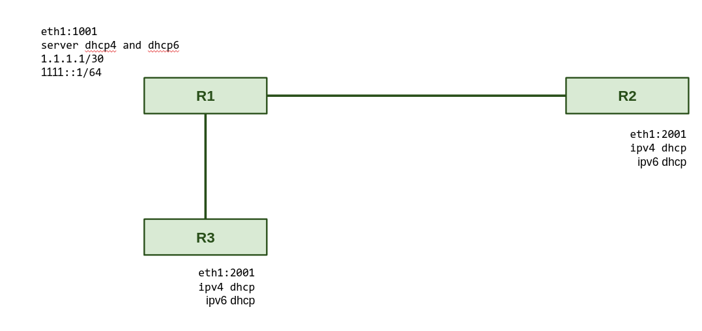

# Experiment-DHCP

## Topology

<div style='display: inline-block'>
   
</div>
 
</br>
 
## Configuration Topology

### R1 Configuration

### R1 - Hardware
```
int eth1 eth 0000.1111.0001 127.0.0.1 26011 127.0.0.1 26021
int eth2 eth 0000.1111.0002 127.0.0.1 26031 127.0.0.1 26041
tcp2vrf 1123 v1 23
```

### R1 - Software
```
hostname r1
buggy
!
!
vrf definition v1
 exit
!
interface ethernet1
 description r1@e1 -> r2@e1
 vrf forwarding v1
 ipv4 address 1.1.1.1 255.255.255.0
 ipv6 address 1111::1 ffff:ffff:ffff:ffff::
 no shutdown
 no log-link-change
 exit
!
interface ethernet2
 description r1@e1 -> r3@e1
 vrf forwarding v1
 ipv4 address 1.1.1.2 255.255.255.0
 ipv6 address 1112::1 ffff:ffff:ffff:ffff::
 no shutdown
 no log-link-change
 exit
!
!                  
server dhcp4 dhr2  
 pool 1.1.1.11 1.1.1.99
 gateway 1.1.1.1   
 netmask 255.255.255.0
 no dns-server     
 domain-name  
 vrf v1            
 exit              
!   
!
server telnet tel
 security protocol telnet
 no exec authorization
 no login authentication
 vrf v1
 exit
!
end
```
## Question 

#### This a topology with three routers (R1, R2 and R3). R1 has two network interfaces connected to two other routers (R1@eth1 -> R2@eth1 and R1@eth2 -> R3@eth1), how do I enable the DHCP server (at the R1) to work with both network interfaces?

