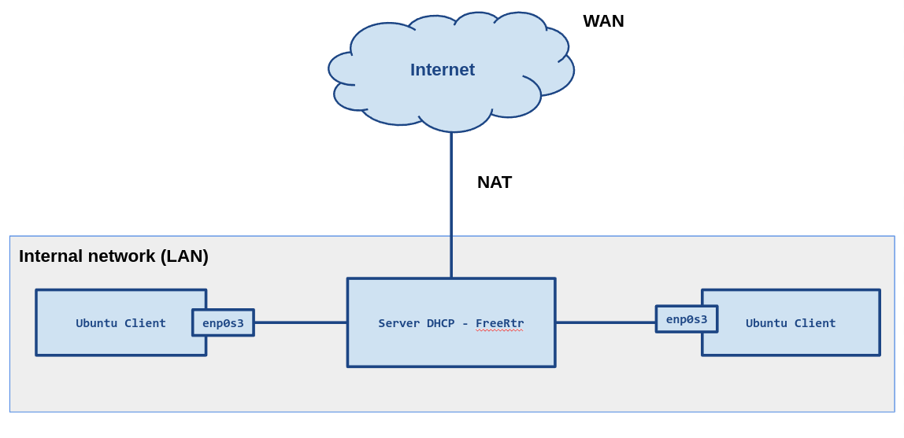
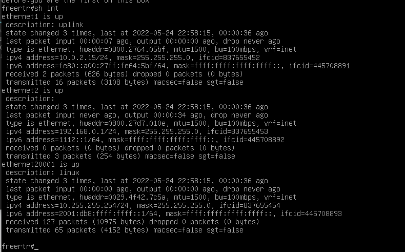

# Experiment-DHCP two

## Topology

<div style='display: inline-block'>
   
</div>
 
</br>
 
## Question 

#### Hi,
#### I decided to test a different DHCP Server topology on FreeRouter. 
#### Topology (VirtualBox):
- Virtual Machine (Debian 11) - FreeRouter
- Two Virtual Machine (Ubuntu) - Ubuntu Client

#### The network configuration, defined a NAT (WAN) to Internet and a Internal network (LAN).

#### I got the client to receive the DHCP IP on the FreeRouter, but it is without external connectivity.

#### I wanted to know if it is necessary to configure a routing policy for the Ethernet1 interface or is a bridge perhaps needed to perform such a routing function?

- Gateway: 192.168.0.1 (Internal network - Interface Ethernet2).

- Objective: Fetch connectivity via 10.0.2.15 (NAT - Ethernet1 interface).

### show interfaces -> FreeRtr
- Output:
<div style='display: inline-block'>
   
</div>

</br>

### Configuration Server DHCP freeRtr:
```
!
…
server dhcp4 dhcp-server
 pool 192.168.0.2 192.168.0.100
 gateway 192.168.0.1
 netmask 255.255.255.0
 no dns-server
 domain-name 
 interface ethernet2
 vrf inet
 exit
!
```
